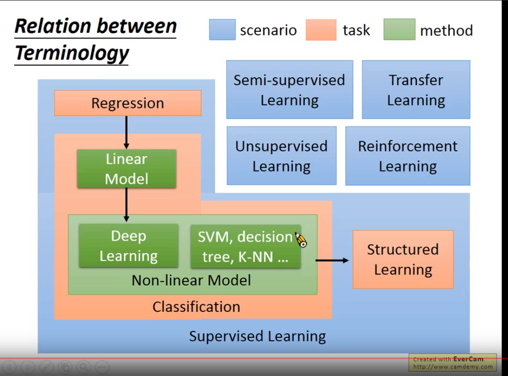
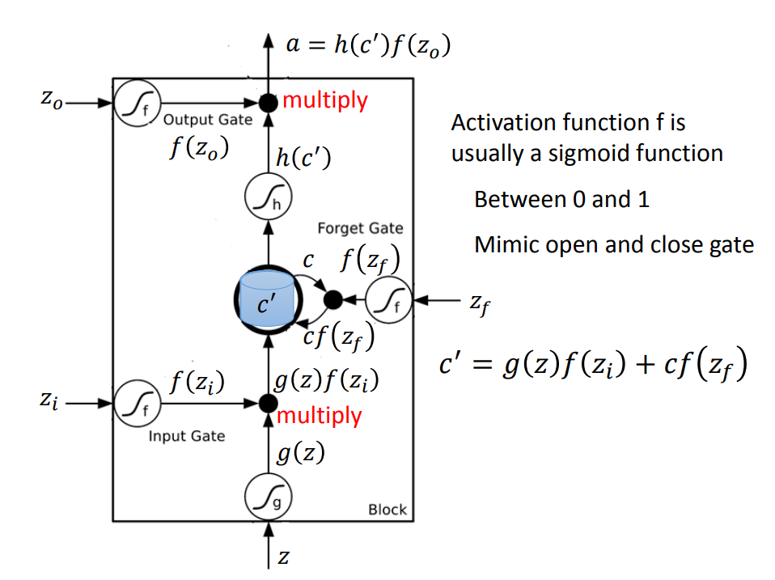
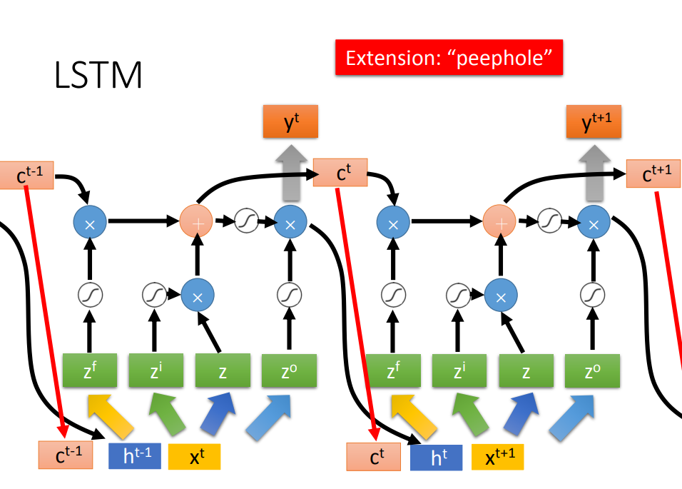

# ML-Lecture-Hung-Yi-Li
 [李宏毅](http://speech.ee.ntu.edu.tw/~tlkagk/index.html)老师的机器学习课程笔记
## 0-1: Introduction of Machine Learning

50年提出**人工智能**

80年代提出**机器学习**

**深度学习**是机器学习的一种方法

Hand-crafted rules: Hard to consider all possibilities

写程式让机器有学习的能力

机器学习约等于从数据里面找到一个函数

**疑问：**

怎么利用机器学习解魔方？

- 深度学习
- 具体怎么实现呢？  

Model: function set 就是一组函数

机器学习三个步骤： 

1.  找一系列的函数: 即model
2.  优化函数:
3. 找出最好的函数

Learning map:

Regression: 气象预报，输出一个数值

Classification: 

- Binary Classification: Spam filter 
- Document Classification:

半监督学习是很

结构图：

**有趣的尝试**：

机器学习让机器生成动物

监督学习：

learning from teacher

learning from critics

AI 训练师

## Regression:

- 股票预测
- 自动驾驶：f(各种传感器信号)=方向盘的角度
- 推荐系统：
- Pokemon的Combat Power

feature

wight 

bias

Loss function: 函数的函数

输出：==how bad it is== , 学会用自然语言去描述一个函数的含义是很有用的。

**Overfitting:** 考驾照的时候在训练场里面很好，实际

A more complex model does not always lead to better performance on testing data.

**疑问**: 更复杂的model对应在Tensorflow里面是更复杂的神经网络吗？

**Regularization**: 重新定义Loss Function

$\lambda$ 让Loss function对输入**不敏感** 

$\lambda$ 不能太大也不能太小

**问题**：为什么Regularition不用考虑bias?

y = wx + b; b只关乎截距

## ML Lecture 3-1: Gradient Descent

### Adagrad

动态调整LR

整体上是LR是逐渐减小的

## ML Lecture 21-2: Recurrent Neural Network

LSTM一个cell:

LSTM结构：

 

当前时刻(t)的输入 $x^t$ 与四个矩阵相乘得到四个不同的向量：

- $z^f$ : to forget gate 
- $z^i$ : to input gate
- $z$ : to input
- $z^o$ : to output gate

门的打开还是关闭是网络训练的结果。这里有个体会：

==那些不好确定的参数，就让机器来确定吧。人搞不定的东西，就交给机器去搞定吧。==

所以t时刻的输入其实是和下面三个因素有关系的，因此RNN具有记忆的功能：

- 上一个时刻的输出
- 记忆
- 这一时刻的输入

因此我们通常说的RNN通常就是指的LSTM网络

